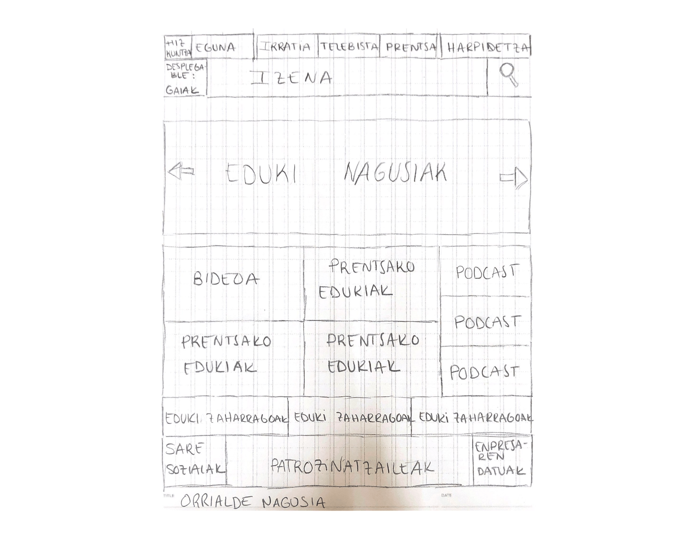
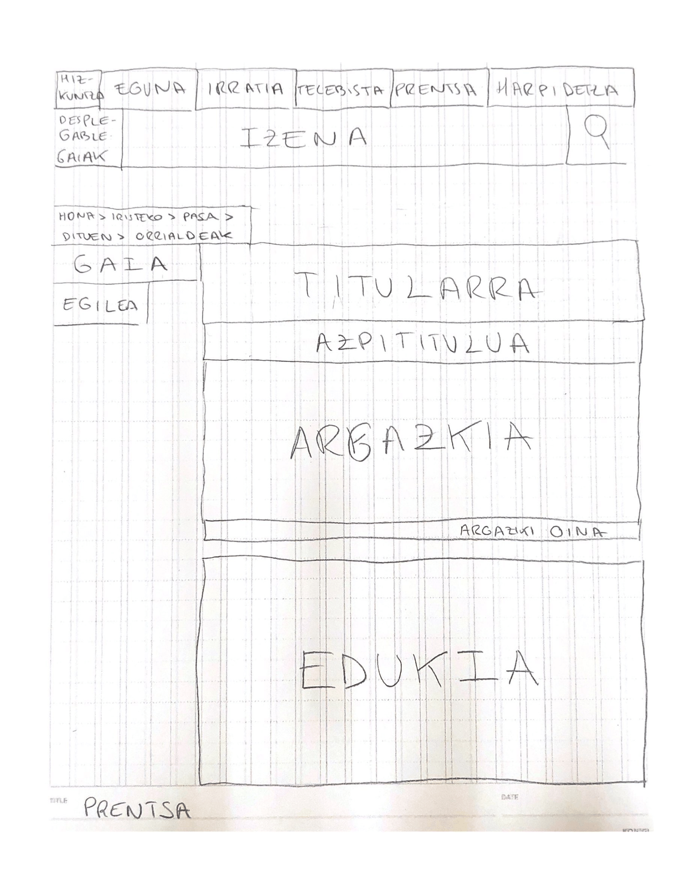
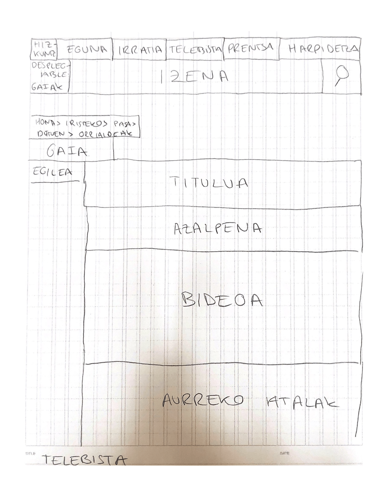
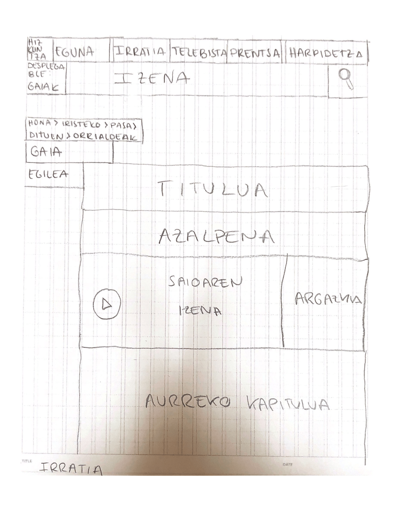

# Wireframes

<!--
Recoged en este documento un listado con enlaces a los diferentes
wireframes que creéis para el proyecto web
-->

Hurrengo argazkiekin gure webgunearen orrialde nagusiak aurkezten ditugu. Lehena gure webgunearen *hasierako orrialdea* da. Bertan, azken edukiak eta nabarmendutako lanak agertuko dira, baita gai ezberdinetara joateko bideak ere. Goiko laukizuzenetan euskarrien arabera edukietara iristeko estekak egongo dira. 

Euskarri bakoitzean mota askotako gaiak jorratuko dira, hau da, euskarriak ez du gaietan inolako eraginik. Horregatik, edukiak bi modutara sailkatuko dira: gaiaren arabera eta euskarriaren arabera. Modu honetan, bide ezberdinak aukeran izanik, publikoak errazago topatu ahal izango du edukia.

Beherago, webgunearen izenaren ezkerraldera, menu zabalgarri bat egongo da. Horren bidez, euskarri bakoitzean gai jakin bati buruz dauden eduki guztiak ikusteko aukera edukiko dute erabiltzaileek. Goiburua webguneko orrialde guztietan mantenduko da.

*Irizpideak*

Orrialdean eduki bakoitzaren kokapena zehaztu ahal izateko honakoak izango dira gure hedabidearen irizpideak:

* Eduki nagusiak
    * Euskarri bakoitzean sakonena, erakargarriena edo interesgarriena den edukia jarriko dugu. Eduki berriak argitaratu ahala, aldatzen joango da zerrenda. 
    * Hasieran aipatutako irizpideak bi modutara erabakiko dira: 
        * Sortzaileen ustea: gai batzuk berezko garrantzia dute, edo trataera sakon batek eramango ditu eduki nagusi izatera.
        * Erabiltzaileen harrera: interes berezia sortzen duen eduki oro sartuko da zerrendan.

* Bigarren mailako edukiak
    * Nagusi izatera iristen ez diren edukiekin gaurkotasuna edo denbora tartea izango da irizpide nagusia. 
    * Euskarrien arabera honakoa da banaketa:
        * Bideoa - Telebista euskarria
        * Podctastak - Irratia euskarria
        * Prentsako edukiak - Prentsa euskarria

* Eduki zaharrak
    * Gehien irakurri diren edukiak izango dira "eduki zahar" moduan hasierako orriadean mantenduko ditugunak.

Prentsako edukietan bi atal edukiko ditu orrialdeak. Gainaldean edukira iristeko pasatako orrialde guztiak azalduko dira, atzera erraz joateko aukera izateko. Bestalde, ezkerraldean, edukiaren gaia eta egilearen izena ere azalduko dira. Atal hau prentsako, irratiko eta telebistako edukiak dauden orrialde guztietan azalduko da. Bigarren atala edukiarena da. Titularra, azpititulua, argazkia eta testua izango ditu. Orrialdearen azpialdean aurrez argitaratutako edukiak edo testuarekin lotutako edukiak egongo dira. 

Telebistako eta irratiko orrialdeak oso antzekoak izango dira. Gainaldean edukira iristeko pasatako orrialde guztiak azalduko dira, atzera erraz joateko aukera izateko. Bestalde, ezkerraldean, edukiaren gaia eta egilearen izena ere azalduko dira. Atal hau prentsako, irratiko eta telebistako edukiak dauden orrialde guztietan azalduko da. Ondoren, atalaren titulua, azalpena, bideoa/podcasta eta aurrez argitaratutako edukiak izango dira orrialdea osatzen duten atalak.

